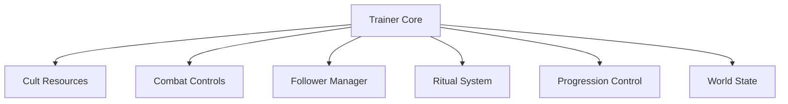

## Overview

Cult of the Lamb Trainer is a runtime control utility designed to interact with active gameplay systems during execution. It exposes parameters related to player combat, cult simulation mechanics, resources, rituals, followers, and progression logic. Operating entirely in memory, the trainer allows live adjustment of values without modifying game files. It is commonly used to analyze balance behavior, isolate cult management systems, and test combat and progression mechanics under controlled conditions.

---

## Cult Resource Manipulation Layer

* Faith and devotion value editing
* Currency and offering control
* Resource quantity injection
* Consumption bypass toggles

**Feature intent:**
Removes resource constraints to allow focused testing of cult growth and management mechanics.

---

## Player Combat State Controls

* Health and damage immunity
* Attack damage multipliers
* Cooldown and stamina bypass
* Hit and invulnerability timing adjustment

**In-game behavior:**
Overrides combat-related calculations to stabilize encounters or test enemy behavior without player failure.

---

## Follower Behavior and Status Manager

* Hunger and illness suppression
* Loyalty and dissent value control
* Fear and faith state locking
* Death and aging prevention

**Feature intent:**
Provides direct access to follower simulation variables, enabling inspection of long-term cult dynamics.

---

## Ritual and Doctrine Override System

* Ritual cooldown reset
* Ritual cost bypass
* Doctrine unlock toggles
* Effect duration control

**In-game behavior:**
Allows immediate triggering and testing of ritual effects without progression or cooldown limits.

---

## Progression and Unlock Controller

* Skill and upgrade unlock flags
* Crown ability activation
* Progress gate bypass
* Level and experience injection

**Feature intent:**
Enables access to mid- and late-game mechanics for analysis without sequential gameplay requirements.

---

## World and Encounter State Adjustment

* Day cycle manipulation
* Dungeon state control
* Environmental hazard disable
* Encounter pause and resume

**In-game behavior:**
Stabilizes world conditions to create repeatable testing scenarios across combat and management layers.

---

## Trainer Configuration Interface

* Modular feature toggles
* Preset profile saving
* Hotkey-based control
* Session-only memory scope

**Feature intent:**
Acts as a centralized control hub, ensuring all trainer features remain temporary and configurable.

---

---

## FAQ

**Does the trainer modify game files?**
No, all changes are applied in memory during runtime.

**Are trainer effects permanent?**
No, all values reset when the session ends.

**Can cult and combat systems be used together?**
Yes, all modules operate independently and concurrently.

**Is real-time adjustment supported?**
Yes, values can be changed while the game is running.

**Are rituals affected by cooldowns?**
Cooldowns can be overridden or reset through the trainer.

**Does it support hotkeys?**
Yes, most features can be bound to custom keys.

---

## Feature Summary

* Cult resource and faith control
* Player combat and damage systems
* Follower behavior and status management
* Ritual and doctrine overrides
* Progression and unlock control
* World and encounter state adjustment
* Centralized modular trainer interface
